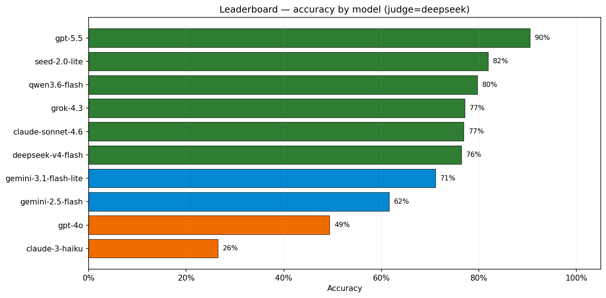
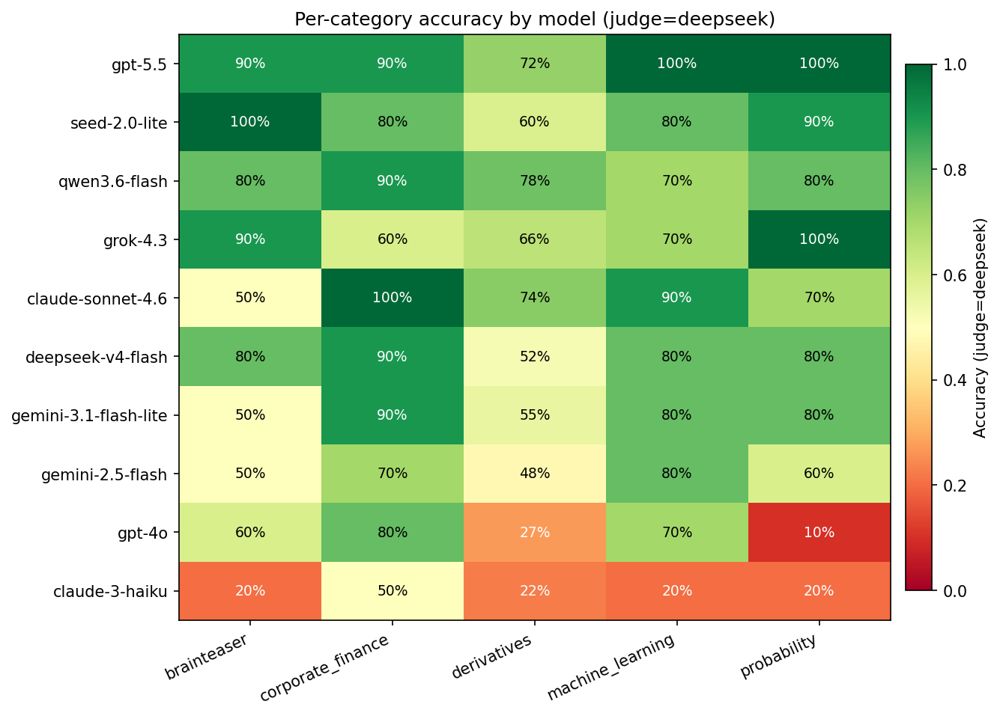
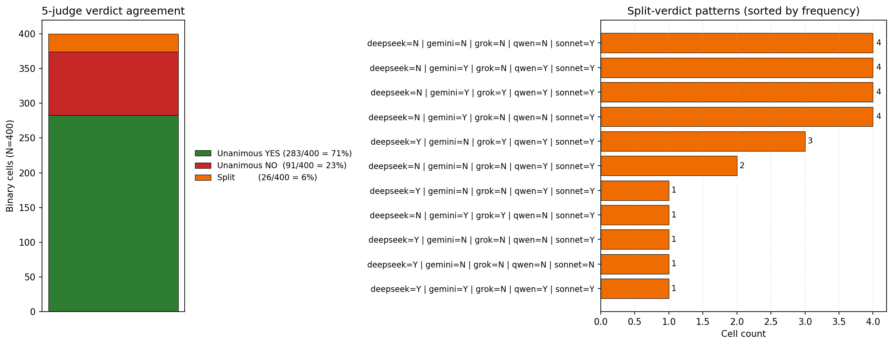
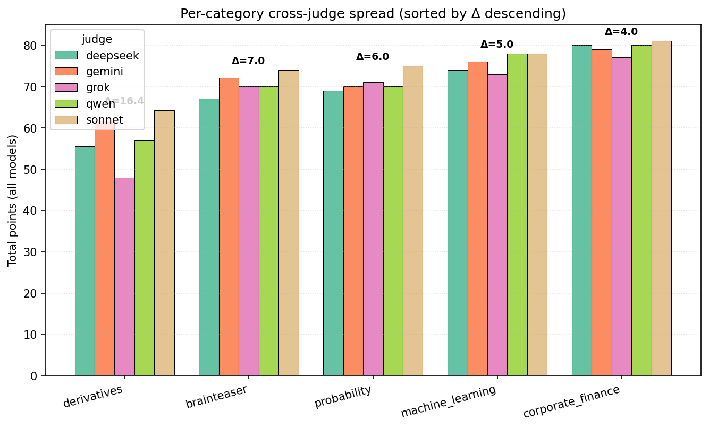
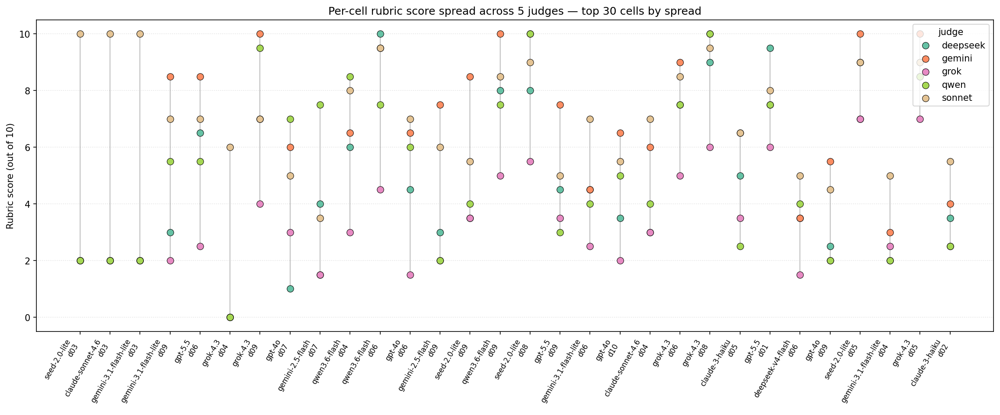

# Quant Interview Benchmark for AI Models

**Can a frontier LLM pass a quant-trading interview? We built a 50-question benchmark to find out — and then we stress-tested the benchmark itself, by re-grading the same answers with five different judges, to see how much the score depends on the model versus the grader.**

This page summarizes the project: what we measured, how we built the dataset, how the evaluation pipeline works, what we found, and what the benchmark cannot tell you. You do not need to clone or run anything to read this; every number on this page is also committed in the repository under [`results/`](https://github.com/daduchen2022/Benchmark-FINM/tree/main/results) if you want to verify it.

---

## 1. Introduction

LLM benchmarks for general math (MATH, GSM8K) and general coding (HumanEval, MBPP) are well established. Quant interviews are different: a single question typically combines mathematical reasoning, financial intuition, careful reading, and the discipline to commit to one answer instead of hedging. A model that crushes GSM8K may still fail a brainteaser whose correct answer hinges on noticing a subtle change of premise.

This project builds a focused benchmark for that setting. It has two goals:

1. **Help a student preparing for quant interviews pick which AI model to study with.** The leaderboard below ranks ten current models on the same 50 questions under identical conditions.
2. **Be useful as research infrastructure.** The dataset is committed, the pipeline is open, and the grader (the "judge" LLM) is pluggable. Anyone can swap a judge, run a subset of questions, or extend the dataset.

### Evaluated models

We evaluated ten models, deliberately mixing recent frontier releases with three older / weaker baselines so that the gap between "best available today" and "what was state-of-the-art last year" is legible on the same questions.

| Tier | Models |
|---|---|
| Frontier (2026) | `gpt-5.5`, `seed-2.0-lite`, `qwen3.6-flash`, `claude-sonnet-4.6`, `grok-4.3`, `gemini-3.1-flash-lite`, `deepseek-v4-flash` |
| Older baselines | `gpt-4o`, `gemini-2.5-flash`, `claude-3-haiku` |

All are accessed through OpenRouter with one API key. No web search, no tools, no code execution — pure native reasoning (we discuss why under § Pipeline Construction below).

---

## 2. Data Collection

The dataset is 50 hand-curated questions split evenly across five categories.

| Category | Skills Tested | Evaluation |
|---|---|---|
| Probability | Conditional, geometric, recursive, and combinatorial probability | Exact-match |
| Brain teaser | Game theory, pattern recognition, optimisation, modular arithmetic | Exact-match |
| Machine learning | Linear regression, statistics, stochastic reasoning, linear algebra | Exact-match |
| Corporate finance | Valuation, capital markets, corporate strategy, time-value calculations | Exact-match (incl. multi-select MCQ) |
| Derivatives | Risk-neutral pricing, options Greeks, Black-Scholes, binomial trees, hedging | Rubric-based (0–10 per question) |

We use **exact-match** with an LLM judge for closed-form answers (a single number, fraction, symbolic expression, or letter set) and a **rubric** for open-ended derivatives questions, where partial credit is needed. Each question contributes at most 1.0 point to a model's final score, so the maximum total is 50.0.

The composition is the result of explicit design choices, one per category:

### 2.1 Probability

This part of the benchmark mainly tests a model's ability to reason and solve probability-type problems. These problems are essentially universal in quant trading because they isolate specific skills and do not require heavy prerequisite knowledge. Unlike pure mathematics or arithmetic problems, **the bottleneck is framing, not computation**: the solver must first identify the right random variables, recognise the structure that makes the problem tractable (symmetry, linearity of expectation, conditional independence, recursion), and only then derive an answer. Calculation is rarely the hard part.

That makes probability an unusually clean probe for a language model: a model that simply pattern-matches on a memorized formula will fail, because every problem requires constructing the setup from scratch. We further enforced this by banning web search and code execution, so a model can only rely on internal reasoning.

The ten questions are chosen to span techniques rather than cluster on one trick:

- **Linearity of expectation and invariants** — `p01` (hat redistribution, `E[T] = n`), `p05` (polygon from stick breaks, `1 − n/2^(n-1)`), `p10` (gift distribution, `1 − (46·10!)/10^10`).
- **Geometric and combinatorial probability** — `p02` (expected number of regions from three random chords), `p03` (conditional probability without replacement, `5/28`).
- **Optimal strategy under partial information** — `p04` (guess the larger from one revealed sample, `3/4`), `p09` (two-box place-or-take ordering, `2961/32`).
- **Information bounds and search** — `p07` (minimum-cost guessing on `[1, 1000]` with three-way feedback).
- **Cross-over with linear algebra** — `p08` (variance of a random matrix's determinant, `n!`).
- **Anti-memorisation guard** — `p06` is the `k+1` generalisation of the famous 100-passenger problem whose memorized answer is `1/2`. The generalisation tests whether a model *understands the argument* or only *recognises the puzzle*. Models that confidently answer `1/2` are pattern-matching.

All ten questions have a clean, exact answer that is either a number or a closed-form expression. A deliberate mix of symbolic answers (`n`, `n!`, `1/(k+1)`, `1 − n/2^(n−1)`) and numerical answers (`25.5025`, `2961/32`, `5/28`) ensures a high score requires both algebraic manipulation and exact computation.

### 2.2 Brain teaser

This category tests whether a model can solve quant-interview-style reasoning problems *after the surface form has been changed*. We are not primarily testing whether a model has memorised famous brainteasers — we test whether it can identify the underlying mathematical or logical structure in a new setting.

Questions are sourced from classical quant-interview brainteasers, then **modified in numbers, setting, and wording** while preserving the core reasoning. Before a question is included, we run a contamination check using a three-part probe pattern:

- **Contamination probe** — a fill-in-the-blank version of the original, to check whether the model recognises the canonical puzzle.
- **Modified question** — the actual benchmark item, with surface changed but the same underlying logic.
- **Decoy question** — one key assumption of the problem is altered, to test whether the model is mechanically applying the familiar solution pattern instead of reading the new prompt.

A candidate question is kept only if the model does **not** produce the `1, 1, 0` response pattern across the three parts (recognises the original, solves the modification, *fails* the decoy by reflex). The `1, 1, 0` pattern signals the modification is too superficial — a model that pattern-matches on the canonical puzzle still scores on the modified version while reflexively missing the decoy's altered assumption. Such candidates are discarded; the survivors are questions where the modification is substantive enough to break the memorised template.

The final ten questions cover recursive elimination, modular arithmetic, minimax search, strategic / game-theoretic reasoning, binary search, work-rate, and adversarial-majority logic.

### 2.3 Machine learning

ML is the category most predictive of whether a model has *genuine reasoning capability* versus *surface-level pattern matching*. The questions are picked from high-difficulty quant-interview ML problems rather than introductory ML vocabulary — every selected question requires computation and reasoning that genuinely distinguishes frontier models from weaker ones.

The ten questions cover four reasoning archetypes:

1. **Symbolic derivation** — `ml01` and `ml07` require the model to set up an optimisation or probability statement, manipulate it symbolically, and produce a closed-form expression. Variables and constraints are structured non-standardly so memorisation does not help.
2. **Probabilistic / Bayesian reasoning** — `ml08` (classic disease-test Bayes question) and dice rolls (`ml02`, `ml09`) test whether the model can identify the right probability framework and avoid common conditional-probability fallacies.
3. **Linear-algebra structure** — `ml03` (R² bounds for two regressors) and `ml04` (reverse-regression slope) require the model to manipulate variance, covariance, and projection relationships — the geometric / algebraic structure of OLS.
4. **Discrete probability with boundary conditions** — `ml05` (German tank problem), `ml06` (expected hitting time on a complete graph), `ml10` (expected number of runs in a card shuffle). These are notoriously easy to *almost* get right and hard to score full points; they are where we expect the cleanest separation between frontier and older-generation models.

A finding worth flagging in this category, surfaced by the data: **`ml06` is a systemic off-by-one trap**. The expected hitting time on a complete graph with `N = 100` nodes, where the walker can choose any node uniformly at random *including the current one*, is `N · H_{N−1} + 1 ≈ 519`. The `+ 1` accounts for the initial uniform placement counting as the first visit. **Eight of ten architecturally different models converged on the wrong answer `518`** — they correctly identified the harmonic-number structure (`100 · H_99 ≈ 517.74`) and rounded up, but missed the boundary correction. That this off-by-one is *shared across vendors* is a stronger signal than any individual model's mistake.

### 2.4 Corporate finance

Corporate finance is structured very differently from ML, and intentionally so. It splits into two sub-blocks that test orthogonal skills:

- **Case analysis (cf01–cf06)** — multiple-choice questions about real-world corporate situations: IPO mechanics, principal-agent problems, governance failures, capital-markets choices. These map to the kind of judgement quant-adjacent analysts need.
- **Numerical calculation (cf07–cf10)** — exact future-value problems where the prompt mentions the **Rule of 72** as a hint, deliberately to see whether the model anchors on the approximation or computes the exact compound-interest value.

This bifurcation surfaces two real failure modes of deployed financial AI:

1. **Multi-select overselection.** When a question does not announce how many options are correct, weaker models hedge by selecting too many. The benchmark scores them as wrong because the expected answer set is exact. This pattern shows up most clearly on `gpt-4o`, `claude-3-haiku`, and `gemini-2.5-flash`.

2. **Rule-of-72 pathology.** The hint says "think about the Rule of 72," but it is meant as a sanity check on doubling time — not the final answer. Several models report a round `$200,000` instead of the precise compound-interest value (`$199,256`, `$199,900`, `$202,237`). The benchmark differentiates models that anchor on the hint from models that use it as a check and compute precisely.

### 2.5 Derivatives

The derivatives category contains ten open-ended quantitative-finance questions sourced from classical interview books (Joshi, Wilmott). Topics include risk-neutral pricing, the Black-Scholes model, option Greeks, early-exercise logic, hedging, replication, and no-arbitrage pricing.

Because the answers are explanatory rather than a single number, we built a **structured rubric** for each question. Each rubric is a JSON object: a `total_points` cap of 10, broken into named `categories`, each containing weighted `criteria` with a `description` of what the answer must contain. We also use a `trap` field on criteria that target known LLM failure modes — if the model commits the listed trap, that criterion is scored 0 regardless of other reasoning.

For example, **Question 1** asks whether two assets with identical volatility but different drifts have the same option price, and how downward jumps affect the call value. The rubric has two 5-point parts:

- **Asset drift comparison (5 points):** (i) state the prices are identical, (ii) explain via risk-neutral pricing and no-arbitrage, (iii) recognise that real-world drift is replaced by the risk-free rate.
- **Impact of downward jumps (5 points):** (i) conclude the call with jumps is *more* expensive — flagged as a trap because LLMs frequently say the opposite — (ii) explain via convex payoff and tangent-line under-hedging, (iii) explain why delta hedging underperforms after a jump.

The rubric judge scores each criterion independently and the cell score is `raw_total / 10`. This lets a model partly correct on conceptual reasoning earn partial credit, instead of being scored 0 for a single mistake — which would be too harsh for open-ended questions.

---

## 3. Pipeline Construction

The pipeline is intentionally minimal. There are no tools, no multi-turn loops, no sampling tricks, and no per-category prompt engineering. Every model gets the same prompt, in the same shape, and is asked once.

### 3.1 One HTTP call per (model, question)

```
data/*.json (50 questions) ──► for each (model, question):
                                  1. call_model    -> raw response   (one HTTP call, no tools)
                                  2a. judge_answer  (binary path)    -> YES / NO
                                  2b. judge_rubric  (open  path)     -> 0..total_points
                                  3. score in [0.0, 1.0]
                               ──► results/{details,summary,scores}_<label>.{json,csv}
```

**Sampling parameters** are fixed: `temperature = 0`, `top_p = 1.0`, `max_tokens = 8192` for the model under test, single greedy decode. One model (`gpt-5.5`) silently ignores these parameters, and the result rows record that with `sampling_controlled = false` so downstream analysis can qualify the comparison. No retries on the answer itself, no majority vote, no consistency averaging — what the model produces on the first call is what gets scored.

### 3.2 Why no tools, no web search, no code execution

We want the benchmark to measure **native parametric reasoning**, not toolchain effectiveness. Many classic interview problems appear on prep sites; allowing web search would let the model retrieve canonical answers and collapse the gap between models. Allowing code execution would convert reasoning problems into Python problems and reward different capabilities. The locked spec for this benchmark explicitly disables all three.

(An earlier project version did support calculator + web search; we removed both after observing that scores compressed near 100 % and model discrimination disappeared. The history is preserved in [`docs/CHANGELOG.md`](https://github.com/daduchen2022/Benchmark-FINM/blob/main/docs/CHANGELOG.md).)

### 3.3 The `Final Answer:` output contract

The model is instructed to end every reply with a line of the form

```
Final Answer: <committed answer>
```

or, if it cannot solve the problem:

```
Final Answer: I don't know
```

This contract gives the binary judge a deterministic anchor for extraction. Without it, judges had to guess where a long reasoning trace committed to a final value — which produced silent mis-grades in early runs. The judge prompt instructs it to use the *last* `Final Answer:` occurrence; only if that line is missing does it fall back to scanning the tail of the response.

If the model truncates at `max_tokens` before producing a `Final Answer:`, the cell is scored 0 and labelled `[truncated]`. This is treated as a model-quality failure (the model failed to deliver an answer in budget), not a re-runnable pipeline error.

### 3.4 The judge

Grading uses an LLM-as-judge. Two judge paths, dispatched by the question's `answer_type`:

- **Binary judge** — sees the question, the expected answer, and the model's full response (head + tail excerpt if the body is very long). It returns three plain-text lines: the extracted answer, a one-line reason, and `YES`/`NO`. We use this for probability, brainteaser, ML, and corporate finance.
- **Rubric judge** — same input plus the JSON rubric. It returns one JSON object: a list of per-criterion scores with one-line comments. We use this for derivatives. `response_format = json_object` is enforced.

The judge model is **pluggable**. The default is `deepseek/deepseek-v4-pro`, chosen for strictness and price; the entry scripts accept a `--judge <openrouter-id>` flag to override it. We used this to run the cross-judge validation experiment described in § 5 below.

### 3.5 Recovery and robustness

LLM benchmarking has many failure modes that have nothing to do with the model under test — upstream providers occasionally return `usage = None`, non-JSON response bodies, or empty `choices`; daily-budget caps return 403; long-reasoning judges sometimes burn the entire token budget on internal reasoning and emit no visible output. The pipeline is built around three principles to keep these from corrupting results:

1. **Every completed cell is appended to a JSONL file under a lock as it finishes.** A network drop mid-run loses zero data.
2. **Three recovery scripts**, each writing a new timestamped output and never overwriting:
   - `resume_run.py` — pick up after a crash, run only the missing `(model, question)` pairs.
   - `rerun_errors.py` — re-run only the cells flagged `error` in a previous run (cheap when the judge failed but the model's reply was preserved).
   - `rejudge_run.py` — re-grade an existing run with a different judge (no model re-calls; isolates the judge effect — the basis of § 5).
3. **Errors live in one place.** A single `pipeline/errors.py` lists every exception that should be caught as a cell-level error (`BinaryJudgeParseError`, `RubricJudgeParseError`, `EmptyChoicesError`, `openai.APIError`, `json.JSONDecodeError`). Anything not in this list propagates so genuine pipeline bugs surface loudly.

The full spec (locked methodology, output schema, full field reference) is in [`docs/SPEC_v3.md`](https://github.com/daduchen2022/Benchmark-FINM/blob/main/docs/SPEC_v3.md).

---

## 4. Results

Primary run: **500 cells** (10 models × 50 questions), judge = `deepseek/deepseek-v4-pro`, total API cost ≈ **$5**.

### 4.1 Leaderboard

| Rank | Model | Score | Accuracy |
|---:|---|---:|---:|
| 1 | gpt-5.5 | 45.25 / 50 | **90.5 %** |
| 2 | seed-2.0-lite | 40.95 / 50 | 81.9 % |
| 3 | qwen3.6-flash | 39.85 / 50 | 79.7 % |
| 4 | grok-4.3 | 38.55 / 50 | 77.1 % |
| 5 | claude-sonnet-4.6 | 38.45 / 50 | 76.9 % |
| 6 | deepseek-v4-flash | 38.20 / 50 | 76.4 % |
| 7 | gemini-3.1-flash-lite | 35.55 / 50 | 71.1 % |
| — | *baseline gap* | | |
| 8 | gemini-2.5-flash | 30.80 / 50 | 61.6 % |
| 9 | gpt-4o | 24.70 / 50 | 49.4 % |
| 10 | claude-3-haiku | 13.25 / 50 | 26.5 % |



**What this tells you, as a reader:**

- **`gpt-5.5` is currently the strongest** at 90.5 %. The next six frontier models are clustered tightly between 71 % and 82 %, separated by less than 5 percentage points — the middle of the leaderboard is closer than it first appears.
- **`seed-2.0-lite` is the cost-performance winner** at #2 overall and roughly **4× cheaper** to query than `gpt-5.5` over the same workload. If you are picking an AI study partner for interview prep and not running thousands of queries, `gpt-5.5` is the safer call; if you are running many, `seed-2.0-lite` is the better trade-off.
- **The SOTA gap is real and large.** The three older / weaker baselines (`gemini-2.5-flash`, `gpt-4o`, `claude-3-haiku`) fall to 49–62 %, far below the frontier band. `claude-3-haiku` lands at 26.5 % — at the floor of what a model with any quantitative reasoning could plausibly score on this dataset.

### 4.2 Per-category breakdown

Different categories discriminate different models. The table below shows total points awarded across all 10 models per category (out of `10 models × 10 questions = 100` possible).

| Category | Total awarded / 100 | Where the difficulty lives |
|---|---:|---|
| corporate finance | 80.0 | `cf07` was hardest — only `seed-2.0-lite` got it under `deepseek` judge |
| machine learning | 74.0 | `ml06` (the off-by-one trap), `ml03` (algebra) |
| probability | 69.0 | `p03`, `p06`, `p07`, `p09` — hard combinatorics |
| brain teaser | 67.0 | `b05`, `b07` — large-integer / cycle problems |
| **derivatives** | **55.55** | rubric-graded; structural ceiling ~60 even for the strongest model |

**Derivatives is the hardest category for everyone.** Even `gpt-5.5` tops out below 70 % on derivatives; the median frontier model is around 55–65 %. Open-ended options-pricing questions reward partial credit, but they also expose incomplete reasoning that binary questions hide. The structural ceiling is real.



**No model is uniformly strong.** `qwen3.6-flash` wins corporate finance and derivatives but is one of the weaker frontier models on probability; `grok-4.3` aces probability and brainteasers but is weak on applied finance. Reading the heatmap row-by-row is more informative than reading the totals — it tells you which model fits which workload.

---

## 5. Evaluation: Cross-Judge Validation

Reporting a leaderboard from one judge is not enough. The grader is itself a language model, which means the grader is a source of error. To quantify it, we ran a **cross-judge validation**: take the same 500 model responses and re-grade them with five different judge models — `deepseek-v4-pro`, `gemini-3.1-flash-lite`, `claude-sonnet-4.6`, `grok-4.3`, `qwen3.6-flash`. Any difference across the resulting scores is the judge, not the model.

### 5.1 The judges agree more than they disagree

Out of the 400 binary cells (i.e. excluding the rubric-graded derivatives questions, which we discuss separately below):

| Pattern | Count | % |
|---|---:|---:|
| All 5 judges say YES | 283 | 70.8 % |
| All 5 judges say NO | 91 | 22.8 % |
| 4-vs-1 (one dissenter) | 13 | 3.2 % |
| 3-vs-2 (genuine split) | 13 | 3.2 % |



**93.6 % of binary cells have unanimous agreement** across all five judges. Disagreement is concentrated on a small handful of hard cells, not spread evenly. That is a good sign: the benchmark is robust on most questions and only borderline on a few.

### 5.2 Where judges disagree, and why

The 6.4 % of cells where judges split is concentrated in three patterns:

1. **Complex symbolic answers requiring equivalence verification.** Examples: `p10` (`1 − (46·10!)/10^10` — a model may report `0.98330752`, `768209/781250`, or an alternate summation formula); `ml07` (a closed-form expression with logs and exponents). Judges differ in how carefully they verify algebraic equivalence rather than literal string match.
2. **Multi-fact long-string answers.** `b02` expects a number *and* a strategy *and* a specific list of test points. Some judges accept "mostly right"; some require full coverage. `b02` alone caused 7 of 12 brainteaser disagreements.
3. **Approximation-vs-exact tolerance.** The Rule-of-72 corporate-finance questions yield approximations close to the exact value. Strict judges (`grok-4.3`, `deepseek-v4-pro`) score `200000` as wrong; lenient judges (`claude-sonnet-4.6`, `gemini-3.1-flash-lite`) accept it.

A separate finding that emerged from this audit: **the original verdict parser had a scoring bug**. The parser used `last_line.startswith("YES")`; some judges prefix the verdict line with a label (`Line 3: YES`), which made `startswith("YES")` return `False` even though the judge clearly meant YES. We caught this while reading the per-category disagreement audits, quantified the blast radius (14 cells across the cross-judge data), and replaced the parser with a tolerant word-token scan. The pre-fix numbers in this report slightly understate the deepseek- and sonnet-judged scores, and we report them as-is for transparency rather than re-running.

### 5.3 Judges have systematic biases



- **Strictness varies.** Summing every model's score under each judge gives a "leniency" gradient on the *same* set of model responses:

  | Judge | Total awarded / 500 | Avg accuracy |
  |---|---:|---:|
  | claude-sonnet-4.6 | 372.25 | 74.5 % (most lenient) |
  | gemini-3.1-flash-lite | 358.70 | 71.7 % |
  | qwen3.6-flash | 355.00 | 71.0 % |
  | **deepseek-v4-pro** | **345.55** | **69.1 % (median)** |
  | grok-4.3 | 338.90 | 67.8 % (strictest) |

  Lenient and strict ends differ by ~6.7 percentage points — purely from grader temperament.
- **Same-vendor effects.** The `claude-sonnet-4.6` judge gives unusually high rubric credit on `d03` where every other judge scores the same answers at 2/10 (see § 5.4); the `gemini-3.1-flash-lite` judge tends to score Google models more generously than the strict judges do. **A judge whose vendor is in the lineup is not a fully neutral referee.** We picked `deepseek-v4-pro` as canonical because it sits at the median of the strictness gradient (not anchoring either end), is a reasoning model that handles algebraic-equivalence checking correctly where flash-class judges fall back to string comparison, and is cheap (~$0.54 per full pass).

### 5.4 Rubric judging is the real noise floor

Cross-judge variance on the **binary** path is small. On the **rubric** path (derivatives), it is substantially larger.



Rubric grading involves judgement calls — *was that explanation thorough enough to award the partial credit?* Different judges set the bar differently. Per-criterion spreads of 0.5–1.5 points are common; the same model on the same derivatives question can score 5/10 from one judge and 7/10 from another. This is the real noise floor of the benchmark, and it explains why even the strongest model tops out around 70 % in this category.

**This does not invalidate the rubric path.** It does mean a derivatives score should be read as a band, not a point estimate, and that ranking within a 1–2 point range on derivatives alone is not reliable.

---

## 6. What This Benchmark Cannot Measure — Limitations

We are explicit about what the benchmark does not tell you, because the rubric we are graded on rewards honest evaluation:

1. **Sample size is small.** 50 questions is enough to rank tiers reliably and to discriminate frontier from baseline. It is **not** enough for tight statistical claims per category. The middle of the leaderboard is within judge noise — claims like "model X is 2 points better than model Y" are not supported.
2. **Single judge per official run.** Even with the cross-judge study, each headline leaderboard is from one grader. A safer methodology would ensemble judges or report a judge-averaged score with error bars.
3. **Training-data leakage risk.** Many classic interview problems appear on prep sites; high scores may reflect memorisation rather than fresh reasoning. The brainteaser contamination probes are our main defence, but they are not foolproof.
4. **No tools, single sample.** We measure one configuration (greedy, no tools, single decode). Real deployments differ — production systems often allow tool use or multiple samples with self-consistency, both of which can substantially change relative rankings.
5. **Provider-side effects we don't control.** Upstream content filters and token-budget truncation occasionally zero out cells. These are recorded transparently (`finish_reason = "content_filter"` / `"length"`) but not retried, so a model penalised this way is not necessarily worse at reasoning — it may just be poorly handled by its provider's safety layer.
6. **One snapshot in time.** All numbers are valid as of May 2026. Frontier models change quickly; expect the leaderboard to age.

---

## 7. Reproduction & Code

Everything on this page is reproducible from the [repository](https://github.com/daduchen2022/Benchmark-FINM). At a high level:

- The 50 questions live under [`data/`](https://github.com/daduchen2022/Benchmark-FINM/tree/main/data) — one JSON file per category.
- The pipeline lives under [`pipeline/`](https://github.com/daduchen2022/Benchmark-FINM/tree/main/pipeline). It is ~1500 lines of Python and depends only on `openai` (used as the OpenRouter SDK), `python-dotenv`, and `matplotlib` for figures.
- Reproducing the leaderboard is three commands from a fresh clone — see the repository's [`README.md`](https://github.com/daduchen2022/Benchmark-FINM/blob/main/README.md).
- The cross-judge experiment is reproducible from `rejudge_run.py --judge <model> --label <name>` over a committed `details_run3.json`.
- Full locked methodology is in [`docs/SPEC_v3.md`](https://github.com/daduchen2022/Benchmark-FINM/blob/main/docs/SPEC_v3.md); version history in [`docs/CHANGELOG.md`](https://github.com/daduchen2022/Benchmark-FINM/blob/main/docs/CHANGELOG.md); AI usage statement in [`AI_USAGE.md`](https://github.com/daduchen2022/Benchmark-FINM/blob/main/AI_USAGE.md).
